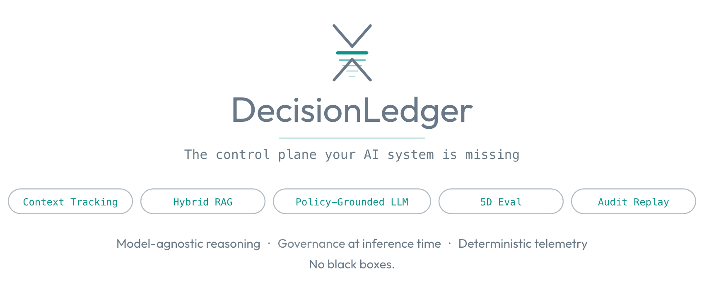
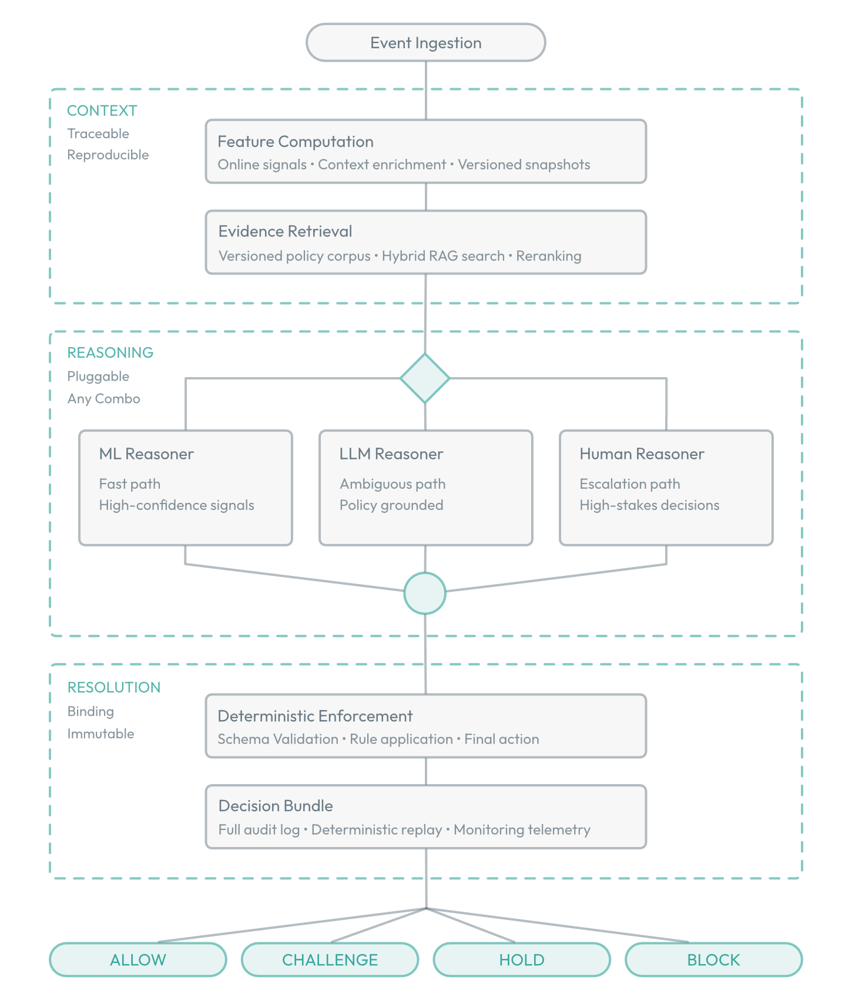
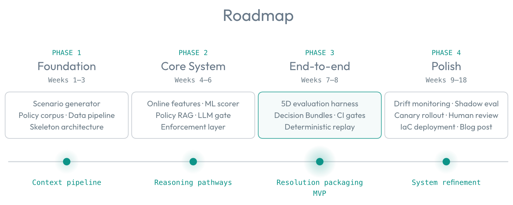

<p align="center">
  
</p>

<p align="center">
  <a href="https://github.com/charleskelley/decision-ledger/actions/workflows/ci.yaml"></a>
  <a href="https://github.com/charleskelley/decision-ledger/actions/workflows/integration.yaml"></a>
  <a href="https://github.com/charleskelley/decision-ledger/actions/workflows/eval.yaml"></a>
</p>

AI outputs are probabilistic. The accountability required when those outputs
affect customers is not. Every production decision needs grounded reasoning,
a policy basis, a citable rationale, and a reproducible audit trail. And every
change to the system that produces those decisions must prove it has not
regressed.

> **This project is designed to demonstrate the engineering principles required 
> to make AI decisioning production-safe:**
>
> * **The reasoning layer is pluggable -** ML, LLM, human, or any combination.
> * **The control layers are constant -** versioned artifacts, evaluation-gated
> releases, and immutable state capture.
> * **The decisions recorded are auditable by design -** deterministic
> enforcement, context and evidence bundling, and full audit replay.
>
> DecisionLedger demonstrates the engineering required when AI outputs affect
> real customers: not just model decision quality, but release control,
> traceability, replayability, and safe operationalization in high-stakes
> environments.

***AI reasons. Policy enforces. Everything is replayable.***

### Current MVP Status

| # | Launch criterion                                                                       | Status |
|---|----------------------------------------------------------------------------------------|--------|
| 1 | `make check` — lint, sqlfluff, typecheck, and unit tests all pass                      | ✅     |
| 2 | `make test-smoke` — all 8 ATO scenarios pass end-to-end                                | ✅     |
| 3 | `make eval` — 5D evaluation harness produces a passing baseline report                 | ✅     |
| 4 | All three GitHub Actions workflows (CI, Integration, Eval) green on `main`             | ⏳     |
| 5 | Versioned baseline eval report ([`outputs/eval/eval-report-v1.json`](outputs/eval/eval-report-v1.json)) committed + linked | ✅     |

When every row reads ✅, the MVP ships. Tracked in
[`zoo/mvp-completion-plan.md`](zoo/mvp-completion-plan.md).

### The Production Problem

Governed AI decision systems introduce operational failure modes that classical
MLOps does not fully cover, especially when retrieval and LLM-based reasoning
enter the path.

Models, prompts, retrieval indexes, and policy corpora all influence behavior.
A change to any of them is a deployment event with behavioral consequences.
Retrieval behavior can drift as the corpus changes without touching application
code. Rationale quality can fail silently even when aggregate model metrics look
acceptable. And when decisions affect customers, probabilistic reasoning still
has to terminate in deterministic accountability.

DecisionLedger treats these as first-class engineering problems with explicit,
testable controls. 

### Engineering Principles Demonstrated

The system is organized around the operating discipline required to make AI
decisioning production-safe:

- **Control-plane architecture** — separate reasoning from enforcement so AI
  contributes to decisions without owning final action semantics.
- **Artifact-aware release management** — prompts, retrieval indexes, policy
  corpora, and model versions are treated as deployable artifacts with explicit
  regression risk.
- **Evaluation-gated change management** — release decisions depend on behavior,
  not just offline model metrics.
- **Replayable, auditable decisioning** — every decision can be reconstructed
  from versioned inputs, retrieved evidence, intermediate state, and final
  enforcement outcome.
- **Design for high-scrutiny environments** — patterns built for domains where
  traceability, policy grounding, and operational safety matter as much as raw
  model performance.

### Decision Pipeline

<p align="center">
  
</p>

DecisionLedger structures runtime decisioning into three layers with fixed
responsibilities:

**Context** — Event ingestion coalesces into observations with online feature
*computation, and policy evidence retrieval via hybrid search (dense embeddings +
*sparse BM25 with cross-encoder reranking) against a versioned policy corpus.
*Every input to the reasoning layer is snapshotted and traceable.

**Reasoning** — A pluggable layer where any combination of reasoners can
operate: a fast ML scorer (XGBoost over engineered features, sub-10ms) for
high-confidence signals, an LLM policy gate for ambiguous cases requiring
elaboration, and a human review path for high-stakes escalation. The framework
requires schema-valid structured output with citations and confidence signals;
the underlying reasoner remains swappable.

**Resolution** — Deterministic enforcement applies policy rules to the reasoning
output and produces the final action. Every decision emits a **Decision Bundle** —
a complete, immutable record of inputs, intermediate state, retrieved evidence,
reasoning output, and enforcement outcome — designed for regulatory review,
legal discovery, and deterministic replay.

### Core Guarantees

| Guarantee                      | Mechanism                                                         |
|--------------------------------|-------------------------------------------------------------------|
| No uncontrolled AI actions     | Reasoning layer proposes; deterministic rule engine enforces      |
| No ungrounded decisions        | Citations required; faithfulness evaluated in CI                  |
| No silent artifact regressions | Every versioned artifact passes behavioral eval before production |
| No silent index drift          | Corpus changes trigger retrieval regression tests                 |
| Full reproducibility           | Every decision replayable from its Decision Bundle                |

 
### The 5D Evaluation Framework

The evaluation harness is the control mechanism that keeps artifact changes from
becoming silent behavioral regressions. Five evaluation dimensions run on every
release candidate — including prompt changes and retrieval index updates, not
just model artifacts:

| Dimension                   | What It Catches                                       |
|-----------------------------|-------------------------------------------------------|
| **Retrieval Quality**       | Wrong policy evidence reaching the reasoning layer    |
| **Generation Faithfulness** | Rationale not grounded in retrieved evidence          |
| **Decision Consistency**    | Action instability across equivalent event orderings  |
| **Citation Accuracy**       | Superficial or irrelevant policy citations            |
| **Adversarial Robustness**  | Injection attempts, schema violations, novel patterns |

No release candidate passes unless all five dimensions clear defined thresholds.
Quality and integration gates run on every push to `main`; the 5D eval harness
runs nightly and on demand via GitHub Actions.
 

---

### Quickstart

```bash
uv sync                        # Install dependencies
cp .env.example .env           # Then paste your OPENAI_API_KEY and ANTHROPIC_API_KEY
docker compose up -d           # Start infra (Redis, PostgreSQL+pgvector, Elasticsearch)
make build-policy-index        # Build and embed the policy corpus
make install-hooks             # Install pre-commit hooks (gitleaks + ruff)

# Run a scenario
uv run python -m scenarios run --scenario post_breach_ato --count 50

# Replay a decision
uv run python -m decision_ledger.audit replay --id <decision_id>

# Run the 8-scenario smoke test
make test-smoke

# Run the full eval gate (uses ANTHROPIC_API_KEY for cross-family judges)
make eval
```

All infrastructure runs locally via `docker compose up`; no cloud account is
required. Two API keys are needed: `OPENAI_API_KEY` for the policy gate and
`ANTHROPIC_API_KEY` for the eval harness's faithfulness/citation judges.
See [`docs/operations/secrets.md`](docs/operations/secrets.md) for full
secrets-handling guidance across local, CI, and production deployment.


---

### Documentation

The full documentation site covers architecture, implementation details, and
design rationale:

**[docs.decisionledger.dev →](https://docs.decisionledger.dev)**

| Section                                                                  | What You'll Find                                             |
|--------------------------------------------------------------------------|--------------------------------------------------------------|
| [Architecture](https://docs.decisionledger.dev/design/architecture/)     | C4 diagrams, component dependencies, directory layout        |
| [Pipeline](https://docs.decisionledger.dev/design/pipeline/)             | Runtime flow, latency budget, fallback paths                 |
| [Evaluation](https://docs.decisionledger.dev/design/evaluation/)         | 5D framework methodology, metrics, CI thresholds             |
| [Data Model](https://docs.decisionledger.dev/design/data/)               | Event schema, Decision Bundle structure, policy corpus model |
| [Design Decisions](https://docs.decisionledger.dev/design/decisions/)    | DR-1 through DR-10 — the significant choices and why         |
| [Infrastructure](https://docs.decisionledger.dev/design/infrastructure/) | Docker Compose stack, Terraform modules, deployment model    |
| [Scenarios](https://docs.decisionledger.dev/design/scenarios/)           | Eight named event patterns and what each exercises           |

 
---

### Transferability Across Domains

DecisionLedger demonstrates the pattern using account takeover detection as the
reference domain. The corpus, feature set, action space, and reasoning layer all
change across domains. The underlying decision-system architecture stays the
same even as the domain changes.

| Domain                    | Corpus                                  | Action Space                               |
|---------------------------|-----------------------------------------|--------------------------------------------|
| Clinical decision support | Treatment guidelines, formularies       | Recommend · Escalate · Override            |
| Content moderation        | Platform policies, jurisdiction rules   | Allow · Remove · Escalate                  |
| Loan underwriting         | Credit policy, fair lending regulations | Approve · Decline · Counter                |
| Regulatory change impact  | Filed regulations, internal policies    | No action · Update required · Legal review |

 
---

### Workplan & Status

<p align="center">
  
</p>

DecisionLedger will not be published until the MVP scope is complete. The table
below distinguishes required launch scope from post-launch polish and
intentional exclusions.

| Phase | Scope | Status |
|---|---|---|
| **MVP** | End-to-end decision path for all 8 scenarios; 5D evaluation harness in CI with thresholds; Decision Bundle construction and deterministic replay; hybrid retrieval with cross-encoder reranking; scenario generator calibrated from real-world distributions | **Required before public launch** |
| **Polish** | Drift monitoring; shadow evaluation and canary rollout infrastructure; human review queue with pre-populated review packets; AWS deployment via Terraform; confidence calibration analysis; technical blog post | **Planned after MVP** |
| **Intentionally out of scope** | UI/dashboard; full Kafka implementation; LLM fine-tuning; real user data; production SLA hardening | **Not part of launch target** |
 
---

<p align="center">
  <sub>
    <a href="https://docs.decisionledger.dev">Documentation</a>&nbsp;&nbsp;·&nbsp;&nbsp;<a href="https://docs.decisionledger.dev/design/decisions/">Design Decisions</a>&nbsp;&nbsp;·&nbsp;&nbsp;<a href="https://docs.decisionledger.dev/design/evaluation/">Evaluation Framework</a>
  </sub>
</p>
 