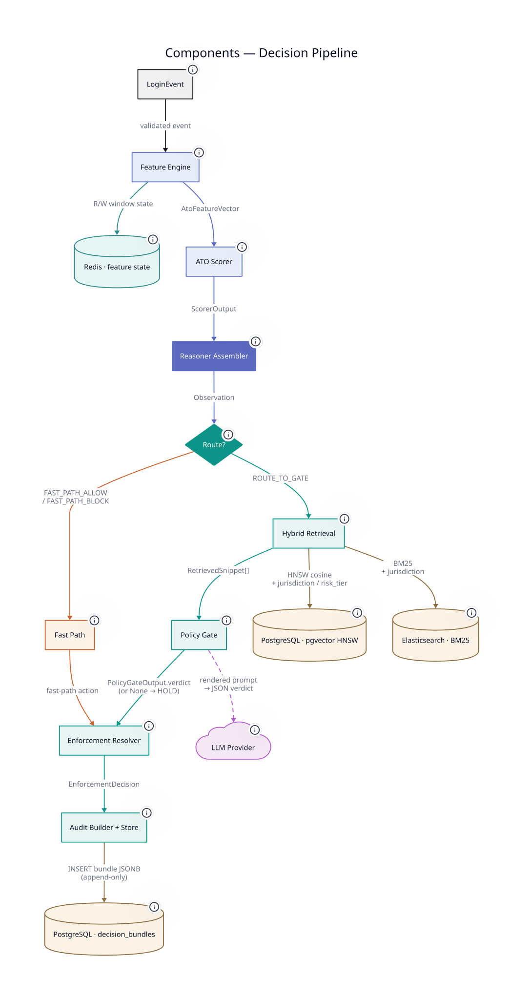

# Architecture

DecisionLedger uses C4-model-based architecture. 

## System Diagram - Level 1



## Containers Diagram - Level 2



## Component Diagram - Level 3 (Decision Pipeline)



---

## Directory Layout

```
decision-ledger/
├── core/                     Framework contracts — domain-agnostic, no infrastructure dependencies
│   ├── decision/                 Decision schema, action space, Observation protocol, bundle contracts
│   ├── policy/                   Policy gate contracts, citation schema, corpus model, enforcement rules
│   ├── llm/                      SDK-agnostic LLMClient protocol (DR-23)
│   └── eval/                     Eval dimension contracts, metric interfaces
│
├── reasoner/                 Domain reasoners — pure types + domain runtime; one subpackage per domain
│   └── account_takeover/         The reference reasoner
│       ├── events.py                Domain event types (LoginEvent, AuthOutcome, ...)
│       ├── features.py              AtoFeatureVector
│       ├── scorer/                  Fast ML scorer (XGBoost), training, inference
│       ├── feature_service.py       Online feature computation (windows, velocity, novelty)
│       ├── ingestion/               Event intake, idempotency, replay keys
│       ├── pipeline.py              Domain pipeline orchestrator (calls into app/decide.py)
│       ├── assembler.py             build_observation() — the framework handoff
│       ├── api.py                   FastAPI router (mounted by app/main.py)
│       ├── settings.py              Reasoner-scoped settings
│       └── registry.py              RegisteredReasoner record
│
├── app/                      Framework runtime — imports from core/ and reasoner/, adds infrastructure
│   ├── decide.py                 execute_decision: framework half of the handoff (retrieval → gate → enforcement → audit)
│   ├── retrieval/                Policy RAG: chunking, embedding, hybrid search, reranking
│   ├── gate/policy/              LLM policy gate
│   │   └── prompts/                  Versioned YAML prompt templates (immutable once created)
│   ├── enforcement/              Deterministic rule application, final action resolution
│   ├── audit/                    Decision Bundle construction, replay store, resolution journal
│   ├── llm/                      LLMClient adapters (OpenAI, Anthropic) — only files allowed to import an LLM SDK
│   ├── monitoring/               Structured logging, latency tracking
│   ├── reasoner_registry.py      Composes mounted reasoners
│   ├── settings.py               FrameworkSettings (.env-driven)
│   └── main.py                   Deployment composer — the only file under app/ that imports from reasoner.*
│
├── eval/                     Evaluation harness — imports from core/eval
│   ├── datasets/                 Golden query sets, adversarial scenarios, consistency tests
│   ├── dimensions/               One module per dimension (retrieval, faithfulness, consistency, citation, robustness)
│   ├── clients/                  Pipeline driver, ragas adapter, judge wrappers
│   ├── runners/                  harness.py — the make eval entrypoint
│   └── prompts/                  Judge prompt templates
│
├── generator/                Synthetic event generator — imports from core/ and reasoner/
│
├── corpus/                   Policy corpus source documents (Markdown + YAML frontmatter)
│
├── infra/                    Local schema bootstrap (Postgres init SQL, Elasticsearch index mapping)
│
├── tools/                    Tracked tooling (e.g. capture_baselines)
│
└── docs/                     Design documentation
    ├── design/                   Architecture, pipeline, data, interface, evaluation, infrastructure
    └── assets/diagrams/          Rendered SVGs (committed; regenerate with `just diagrams`)
```

### The `core/` and `reasoner/` Boundaries

`core/` is intentionally free of infrastructure dependencies — no Redis clients, no database drivers, no LLM SDK imports, no FastAPI. It contains the framework's Pydantic contracts, protocols, action space definitions, bundle structure, and evaluation metric interfaces. `core/` imports from nothing internal.

`reasoner/` contains the ATO Reasoner domain layer: `LoginEvent`, `AtoFeatureVector`, `ScorerOutput`, and policy enums. Like `core/`, it has zero infrastructure dependencies. The distinction is semantic: `core/` is the framework (domain-agnostic); `reasoner/` is the reference implementation domain (ATO-specific). `reasoner/` imports from `core/`; `core/` never imports from `reasoner/`.

These two boundaries enforce: (1) testability — both layers are unit-testable without Docker running; (2) modularity — adding a second reasoner domain requires zero changes to `core/` or `app/`; (3) legibility — a reader can understand the complete decision model by reading `core/` without encountering any ATO-specific types.

`app/`, `eval/`, and `generator/` import from both `core/` and `reasoner/`. Nothing imports from `app/` except `app/` itself.

---

## Component Overview

Twelve components across the pipeline, organized by phase:

| ID | Component | Layer | Phase |
|----|-----------|-------|-------|
| C1 | Scenario Generator | `generator/` | Foundation |
| C2 | Policy Corpus | `corpus/`, `app/retrieval/` | Foundation |
| C2b | Reasoner Assembler | `reasoner/account_takeover/assembler.py` | Foundation |
| C3 | Idempotent Ingestion | `reasoner/account_takeover/ingestion/` | Foundation |
| C4 | Online Feature Computation | `reasoner/account_takeover/feature_service.py` | Core |
| C5 | Fast ML Scorer | `reasoner/account_takeover/scorer/` | Core |
| C6 | Policy RAG Retriever | `app/retrieval/` | Foundation → Core |
| C7 | LLM Policy Gate | `app/policy_gate/` | Core |
| C8 | Deterministic Enforcement | `app/enforcement/` | Core |
| C9 | Decision Bundle + Replay | `app/audit/` | Core |
| C10 | Evaluation Harness | `eval/` | Eval |
| C11 | CI Gate | `.github/workflows/` | Eval |
| C12 | Monitoring | `app/monitoring/` | Eval |

---

## C4 Container Diagram

See [Containers Diagram - Level 2](#containers-diagram-level-2) above.

D2 source: [`docs/design/diagrams/containers.d2`](diagrams/containers.d2)

---

## Dependency Rules

The dependency graph is strictly layered:

```
generator/ ──→ core/, reasoner/
eval/      ──→ core/eval, reasoner/
app/*      ──→ core/*, reasoner/*
app/*      ──→ infrastructure (Redis, PostgreSQL, Elasticsearch, OpenAI)
reasoner/* ──→ core/*
core/*     ──→ [nothing internal]
```

Two violations are hard build failures: (1) anything in `core/` importing from `reasoner/` or `app/`; (2) anything in `core/` or `reasoner/` importing from an infrastructure SDK. The test: can this code be unit-tested without Docker running? If no, it does not belong in `core/` or `reasoner/`.

---

## Naming Conventions

| Context | Form | Example |
|---------|------|---------|
| Repo slug | kebab-case | `decision-ledger` |
| Python package / imports | snake_case | `decision_ledger` |
| Class / type references | PascalCase | `DecisionBundle`, `PolicyGateOutput` |
| Prose / documentation | two words | "Decision Ledger" |
| CLI tool | kebab-case | `decision-ledger replay` |
| Pydantic models | PascalCase | `LoginEvent`, `FeatureVector` |
| Enums | UPPER_SNAKE_CASE | `DecisionAction.HOLD` |
| Feature names | snake_case strings | `"velocity_1min"`, `"geo_novelty_score"` |
