# Reasoner Handoff Contract

The handoff between a domain reasoner and the DecisionLedger framework is the
most important integration boundary in the system. This document defines the
contract — what the domain must provide, what the framework consumes, where
responsibility lies, and how the ATO Reasoner satisfies it as the reference
implementation.

---

## What the Handoff Is

A **domain reasoner** is the ML system that owns observation, feature
computation, and risk scoring for a specific decision domain. In the reference
implementation, the ATO Reasoner is responsible for: ingesting login events,
computing sliding-window behavioural features, and scoring risk with an
XGBoost model.

The **DecisionLedger framework** takes over from there: policy retrieval, LLM
policy gate reasoning, deterministic enforcement, and Decision Bundle
construction. The framework is domain-agnostic — it has no knowledge of login
events, account IDs, or XGBoost scores unless the domain explicitly provides
that context through the handoff contract.

The handoff happens at a single point: when the domain assembler calls
`build_observation()` and submits the result to the framework pipeline.
Everything before that call is the domain's responsibility. Everything after
is the framework's.



---

## Operating Modes

### Governed Mode (reference implementation)

The domain participates in policy gate oversight. The framework runs full ML +
LLM policy reasoning on every observation. The domain must provide both
`ReasonerContext` and `GateContext` on every observation — including fast-path
ones (see Shadow Evaluation below).

Two routing paths exist within governed mode:

- **Route to Gate** — the domain's confidence band is ambiguous. The framework
  invokes the policy gate, which retrieves relevant policy snippets and calls
  the LLM to produce a structured decision.
- **Fast Path** — the domain's score is in a high-confidence band
  (`FAST_PATH_ALLOW` or `FAST_PATH_BLOCK`). The framework bypasses live gate
  invocation and enforces the fast-path action directly. A `FastPathRecord` is
  required; `GateContext` is still required (for shadow evaluation).

### Audit-Only Mode (future — not implemented in MVP)

The domain opts out of the policy gate entirely. `GateContext` is not required.
DecisionLedger functions as a centralised audit ledger — recording the domain's
decisions for cross-system comparability and compliance reporting. Shadow
evaluation, backtesting, and Reasoner vs Gate comparisons are unavailable.

Opt-out is a registration-time governance decision, not a per-observation flag.
It requires documented justification (e.g., the domain embeds policy rules
upstream, or operates in a risk area with no applicable policy corpus).

---

## The Handoff Contract

### `Observation` Protocol (`core/decision/observation.py`)

The framework accepts any type satisfying this protocol (structural subtyping,
PEP 544). The ATO Reasoner satisfies it via `LoginEvent`.

| Field | Type | Required | Notes |
|---|---|---|---|
| `event_id` | `str` | Always | Unique event identifier |
| `entity_id` | `UUID` | Always | Framework UUID — derived from domain business key via UUID5 |
| `entity_type` | `str` | Always | Subject classification (e.g., `"account"`) |
| `timestamp` | `datetime` | Always | When the event occurred (UTC) |
| `routing` | `GateRouting` | Always | `ROUTE_TO_GATE`, `FAST_PATH_ALLOW`, or `FAST_PATH_BLOCK` |
| `reasoner_context` | `ReasonerContext \| None` | Governed mode | `None` only in intermediate pipeline stages pre-assembly |
| `fast_path_rationale` | `str \| None` | Fast path only | Required when routing is fast path — human-readable explanation of why the policy gate was bypassed. `None` when routing to gate. `ObservationContractError` raised if absent on fast-path submission. |
| `gate_context` | `GateContext` | Governed mode | Required on all observations — including fast path |

---

### `ReasonerContext` (`core/decision/reasoner_context.py`)

The domain-agnostic record of what the ML model computed. The framework stores
this verbatim in the Decision Bundle. It is the evidence that makes any
decision auditable and replayable without calling back to the source reasoner.

```
ReasonerContext
├── reasoner_id: str              "ato-reasoner"
├── reasoner_name: str            "ATO Reasoner"
├── model_version: str            "xgb-v1.2.0"
├── inference_latency_ms: float   2.5
│
├── label_type: LabelType         NUMERICAL | CATEGORICAL
├── label_name: str               "risk_score"
├── label_value: float | str      0.87
│
├── feature_set: dict             {velocity_1min: 12, device_novelty: 1.0, ...}
│   All named feature values the model consumed at inference time.
│   This is what makes replay self-contained.
│
└── attribution: AttributionSummary | None
    ├── observation_signals: list[Signal] | None   per-event SHAP values
    ├── feature_importance: dict[str, float] | None   global model weights
    └── narrative: str | None                      free-form explanation
```

**Label types:**

| `label_type` | `label_value` | Example |
|---|---|---|
| `NUMERICAL` | `float` | Risk probability: `0.87` |
| `CATEGORICAL` | `str` | Class label: `"FRAUD"` |

**Attribution:** At least one field in `AttributionSummary` should be populated
for meaningful audit quality. Observation-level SHAP values are the highest
value form — they explain why this specific decision was made, not just what the
model tends to do in general. Attribution is optional because not all deployed
models expose it (vendor black-box models, rule-based reasoners). Omitting it
does not break the pipeline but reduces explainability in the Decision Bundle.

---

### `GateContext` (`core/decision/gate_context.py`)

The domain-assembled context for policy gate operation. The framework uses
`jurisdictions` and `risk_tier` as retrieval filters, and uses
`prompt_template_id` + `template_vars` to render the LLM prompt.

```
GateContext
├── prompt_template_id: str        "ato-v1"
│   Audit key — recorded verbatim in DecisionBundle.
│   Used to look up the template from PromptRegistry.
│   Immutable once deployed; changes require a new version.
│
├── template_vars: dict[str, str]  {"risk_score": "0.870", "auth_method": "PASSWORD", ...}
│   Pre-rendered strings substituted into the prompt template.
│   Domain assembler renders typed values to human-readable strings.
│   Must satisfy the template's required_vars.
│
├── jurisdictions: list[str]       ["US_FEDERAL", "INTERNAL"]
│   Corpus retrieval filter — applied to both pgvector HNSW and Elasticsearch.
│   Empty list = no jurisdiction filter (all documents are candidates).
│
├── risk_tier: str | None          "HIGH_VALUE"
│   Corpus retrieval filter — applied to pgvector HNSW only.
│   None = no tier filter (all tiers are candidates).
│
└── target_model: str | None       "gpt-4o-2024-08-06"
    Optional LLM model hint. Framework may honor or override per governance policy.
```

**Retrieval filter behaviour:**

| Filter | pgvector (dense) | Elasticsearch (sparse) |
|---|---|---|
| `jurisdictions` | ✓ `WHERE jurisdiction = ANY(%s)` | ✓ `{"terms": {"jurisdiction": [...]}}` |
| `risk_tier` | ✓ `WHERE risk_tier = %s OR risk_tier IS NULL` | ✗ not applied |

**Why `GateContext` is required on fast-path observations:**
See Shadow Evaluation below.

---

### Intake Validation (`core/decision/observation.py`)

The framework calls `validate_observation(obs)` at submission before any
routing or policy gate invocation. This is the authoritative enforcement point
for the Observation contract — it applies to every domain reasoner
implementation regardless of the concrete type.

Two contracts are checked:

1. **`reasoner_context` must not be `None`** in governed mode. All framework
   pipeline operations require a populated `ReasonerContext`.
2. **`fast_path_rationale` must be present when `routing` is `FAST_PATH_*`.**
   The policy gate was bypassed — the rationale is the mandatory audit trail
   explaining why.

Violations raise `ObservationContractError`, which names the responsible
reasoner (from `reasoner_context.reasoner_id`) and describes the specific
clause broken. This makes it unambiguous which domain component failed to
satisfy the contract.

---

## Responsibility Boundary

| Responsibility | Reasoner | Framework |
|---|---|---|
| Raw event schema (`LoginEvent`, `ContentItem`, …) | ✓ Owns | — |
| Ingestion adapter (Redis Streams, Kafka, etc.) | ✓ Owns | — |
| Feature computation infra | ✓ Owns | — |
| ML model artifacts + training | ✓ Owns | — |
| Risk scoring at inference | ✓ Owns | — |
| Retrieval-query rendering | ✓ Owns | Consumes string |
| Routing decision (`GateRoute`) | ✓ Produces | Consumes |
| `ReasonerContext` assembly | ✓ Assembles | Stores verbatim |
| `GateContext` assembly | ✓ Assembles | Consumes |
| `fast_path_rationale` | ✓ Provides (fast path) | Validates + stores |
| `entity_id` derivation (UUID5) | ✓ Owns | Uses |
| Reasoner registration record | ✓ Owns | Validates against |
| FastAPI route for the reasoner | ✓ Owns | Mounts via `app.include_router` |
| Raw-event JSON deserializer | ✓ Provides factory | Stores it on `BundleStore` |
| Policy corpus retrieval | — | ✓ Owns (filters by `reasoner_id`) |
| Policy gate invocation | — | ✓ Owns (reasoner-agnostic) |
| Deterministic enforcement | — | ✓ Owns |
| Decision Bundle construction | — | ✓ Owns |
| Idempotency + deduplication | — | ✓ Owns |
| Audit storage (Postgres `decisionledger.*`) | — | ✓ Owns |
| Shared infra config (`postgres_*`, `redis_*`, ES, LLM keys) | — | ✓ Owns |
| Reasoner-specific config (`ATO_SCORER_MODEL_PATH`, …) | ✓ Owns (`ATO_*` prefix) | Reads via reasoner Settings |

The domain pipeline is the only orchestrator that crosses the boundary. It is the
reasoner's responsibility to ensure the assembled `Observation` is correct and
complete before submission. The framework trusts the submitted observation — it
does not re-validate domain-specific logic.

The `app/main.py` lifespan is the deployment composer. It is the **single
sanctioned `app/` → `reasoner/` import seam**: it imports each registered
reasoner's router and any factories the reasoner provides (e.g., the raw-event
deserializer for replay), constructs shared infrastructure (Postgres / Redis /
ES connections, LLM clients), and injects them. No other framework module
imports from `reasoner.*` — `tests/test_framework_boundary.py` enforces this.

---

## Shadow Evaluation

`GateContext` is required on **every** observation, including fast-path ones.
This is not overhead — it is what makes shadow evaluation possible.

Shadow evaluation is the ability to retrospectively route any fast-path
decision through the policy gate offline, using the exact same observation
context that was present at decision time, without re-running the domain
pipeline. This enables:

- **Backtesting** — after deploying a new policy or prompt version, evaluate
  how past fast-path decisions would have been handled under the new regime.
- **Reasoner vs Gate comparison** — for any population of fast-path decisions,
  quantify how often the gate would agree or disagree with the scorer's routing.
- **Calibration evidence** — evidence that the fast-path confidence thresholds
  are correctly set relative to what the gate would have decided.

If `GateContext` is absent on fast-path observations, shadow evaluation is
permanently unavailable for those decisions. The DecisionBundle would be
incomplete.

---

## The Assembler Pattern (ATO Reference Implementation)

The ATO Reasoner implements the handoff via `build_observation()` in
`reasoner/account_takeover/assembler.py`. The function takes the three domain
artifacts and returns a fully-populated `LoginEvent` satisfying `Observation`.

### Translation mapping

```
ScorerOutput → ReasonerContext
  reasoner_id           = "ato-reasoner"
  reasoner_name         = "ATO Reasoner"
  model_version         ← scorer_output.scorer_version
  inference_latency_ms  ← scorer_output.inference_latency_ms
  label_type            = NUMERICAL
  label_name            = "risk_score"
  label_value           ← scorer_output.risk_score
  feature_set           ← AtoFeatureVector fields as a flat dict
  attribution           ← AttributionSummary(observation_signals=top_signals)

LoginEvent + ScorerOutput → GateContext
  prompt_template_id    = "ato-v1"
  jurisdictions         ← resolved from event.geo.country (US → US_FEDERAL + INTERNAL)
  risk_tier             ← resolved from risk score band (≥ 0.60 → HIGH_VALUE)
  template_vars         ← rendered strings for each {placeholder} in ato-v1.yaml

ScorerOutput → fast_path_rationale  (only when routing ≠ ROUTE_TO_GATE)
  Human-readable description of the confidence-band rule that fired.
  e.g. "risk_score=0.930 > 0.85 → FAST_PATH_BLOCK"
  Set directly on the outbound Observation. None when routing to gate.
```

### Implementing a new reasoner

A new reasoner ships as a single self-contained package under
`reasoner/<domain>/`. The framework remains untouched — no `app/` changes
beyond the deployment composer (`app/main.py`) mounting the new router.

**File-by-file checklist** — using the proposed `content_moderation` reasoner
as a worked example:

```
reasoner/content_moderation/
├── events.py               # ContentItem (the raw event), domain enums
├── features.py             # ContentFeatures Pydantic shell
├── scorer/                 # ML scorer infra + model artifact
│   ├── output.py           # ContentScorerOutput Pydantic shell
│   ├── scorer.py           # Inference (e.g. transformers / classifier)
│   ├── trainer.py          # Training entry point (CLI: python -m ...)
│   └── models/cm-v1.ubj    # Trained artifact (or .safetensors etc.)
├── ingestion/              # Adapter for the reasoner's input source
├── feature_service.py      # Feature computation infra (Redis-backed etc.)
├── retrieval_query.py      # build_cm_query(event, scorer_output) -> str
├── assembler.py            # build_observation(event, features, scorer)
├── pipeline.py             # run_cm_decision(event, …) -> DecisionBundle
├── api.py                  # FastAPI router for POST /api/v1/cm/decisions
├── settings.py             # CmSettings (env_prefix="CM_")
└── registry.py             # CM_REGISTRATION constant
```

**Steps:**

1. **Define your domain types** in `events.py`, `features.py`,
   `scorer/output.py`. Pure Pydantic — `core/` types and stdlib only.

2. **Derive `entity_id`** deterministically from your domain business key via
   UUID5. Use a fresh namespace UUID (mirror the ATO pattern with
   `_CM_CONTENT_NS`). The ATO scorer/output need not be modified.

3. **Build your scorer + feature infra** under `scorer/` and
   `feature_service.py`. Use whatever ML framework, retrieval store, or
   feature store fits — this is where reasoner-specific infra lives.

4. **Write your assembler** (`assembler.py`). The `build_observation(event,
   features, scorer)` function returns a type satisfying the `Observation`
   protocol with `reasoner_context.reasoner_id = "content-moderation-reasoner"`,
   populated `gate_context`, and a fast-path rationale when applicable.

5. **Render your retrieval query** (`retrieval_query.py`). Map the top scorer
   signals + raw-event metadata to a natural-language string. The framework
   retriever consumes this string — it never sees your event schema.

6. **Write your pipeline** (`pipeline.py`). `run_cm_decision(event, services…)`
   computes features, scores, calls `build_observation`, then delegates to
   `app.decide.execute_decision(observation, query, …)`.

7. **Mount your FastAPI router** (`api.py`). Define an `APIRouter(prefix=
   "/api/v1/cm")`, register `POST /decisions`, and pull services from
   `request.app.state`. Add `app.include_router(cm_router)` to `app/main.py`.

8. **Add your settings class** (`settings.py`). `CmSettings` with
   `env_prefix="CM_"` for any genuinely reasoner-specific config (model
   paths, corpus version, domain-tunable thresholds). Shared infra
   (Postgres, Redis, ES, LLM keys) stays in `FrameworkSettings`.

9. **Register a prompt template** in `app/gate/policy/prompts/<template-id>.yaml`.
   Define the `{placeholder}` variables your assembler populates in
   `template_vars`. The `YamlPromptRegistry` loads it at startup.

10. **Add your registration constant** (`registry.py`). `CM_REGISTRATION =
    ReasonerRegistration(reasoner_id="content-moderation-reasoner", ...)` —
    the deployment composer collects this with the ATO registration.

11. **Load your policy corpus** with the reasoner-id flag:
    ```bash
    uv run python -m app.retrieval.corpus_loader \
        --reasoner-id content-moderation-reasoner --wipe
    ```

12. **Wire the deployment composer**. In `app/main.py:lifespan`, construct
    `CmSettings()` alongside `AtoSettings()`, build the CM scorer + feature
    service, attach to `application.state`, and call
    `app.include_router(cm_router)`. This is the **only** `app/` →
    `reasoner.content_moderation` import; the boundary test will fail if any
    other framework file imports CM-specific symbols.

The framework's audit ledger, retrieval index, and policy gate are shared
across reasoners. CM decisions land in the same `decisionledger.decision_bundles`
table as ATO decisions, distinguished by `reasoner_id = "content-moderation-
reasoner"`. The retrieval corpus and policy chunks share the index, filtered
by `reasoner_id` at query time. No schema changes are required.

---

## Replay Guarantee

A Decision Bundle is considered complete and replayable if and only if:

1. `raw_event.reasoner_context.feature_set` contains the full feature snapshot
   at inference time (enables feature drift detection on replay).
2. `raw_event.reasoner_context.model_version` identifies the model artifact
   used (enables version-specific replay analysis).
3. On fast path: `raw_event.fast_path_rationale` records the confidence-band
   rule that fired (enables threshold verification without re-running inference).
4. On gate path: `gate_input` and `gate_output` are stored (typed
   contracts per DR-19). Replay re-runs enforcement against
   `gate_output.verdict` — the gate is not re-invoked, regardless of its
   implementation.
5. `raw_event.gate_context` carries `prompt_template_id` and `template_vars`
   (enables reconstruction of the exact prompt that was rendered, and shadow
   evaluation of any fast-path decision).

The enforcement layer is deterministic: re-executing `enforcement.resolve()`
against the logged `gate_output.verdict` must produce the same `decision_action`.
This is the replay guarantee. It holds because the LLM output is cached — not
because the LLM itself is deterministic.
